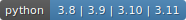

<p>
    <h2 align="center">The Last Algorithms Course You'll Need</h2>
    <h5 align="center">presented by ThePrimeagen on FrontendMasters.com</h5>
    <h6 align="center">in Python</h6>
</p>


[](https://github.com/Andrei-Aksionov/TheLastAlgorithmsCourseYouWillNeed/actions/workflows/test.yaml)

***
<p align=center></p>

Have you heard about an awesome [algorithms course](https://frontendmasters.com/courses/algorithms/) on FrontendMasters.com presented by ThePrimeagen? If no, then you are missing a lot: it is well explained and presented in a clear and sometimes funny way (it's ThePrimeagen after all :smirk:) yet coveres all the basic in a deep enough manner.

Is it indeed the last algorithmic course you will ever need? Highly doubt about it. The course teaches you the basics, the rest you have to learn yourself by practicing.

> It's like driving school in a way that it teaches you the basics. The remaining stuff that makes you a PRO driver you have to learn on your own: double parking, tailgating, left lane hogging, yelling at other drivers and constantly honking (if you are a New Yorker) :grinning:.

Have I mentioned that [FrontendMasters.com](https://frontendmasters.com/) provides you a free access to any 5 course of your choice? Yes, this algorighms course is for free. So what are you waiting for? Steady, ready, go ... :runner:

# Motivation of this repository

The main caveat of the course (that you might have already spotted) is that it's for fronted developers, so the code is presented in javascript/typescript. I don't know any of those, I'm just an average python developer :monkey:

The good thing that algorithms are more or less a universal thing, so it's easy to understand them even if they are written in other language. That means that if you know only python that should not stop you. I mean if I somehow managed to understand the code in the course you can definitely do the same.

The bad thing that all the test that are provided for the course are also for javascript/typescript (or only typescript, for me it's all the same thing :shraud:). That why this repo is created.

> *Note* How you should use this repo: watch the course, implement algorithms here and run corresponding tests. It's that easy!

Good luck and happy programming.

# How to use it

1. Install all the required packages. In this project all the python dependencies are managed by [Poetry](https://python-poetry.org/) and are stored in "pyproject.toml" file (in this file also specified required version of python). After `poetry` is installed and virtual environment is created (in case you don't want poetry to create it [automatically](https://python-poetry.org/docs/configuration/#virtualenvscreate)), run:

    ```bash
    poetry install
    ```

2. Implement algorithm and run tests:

    - To run all tests:

        ```bash
        pytest
        ```

    - To run specific test by providing path, which mimics path to the file with algorithm `course->test/...`, so for file `course/search/linear_search.py` it will be:

        ```bash
        pytest tests/search/linear_search_test.py
        ```

    - To run the whole chapter you can use pytest marks:

        ```bash
        pytest -m search
        ```

# Want to participate in development?

Install all packages required for development:

```bash
poetry install --with dev
```

## Additional: pre-commit hooks

> **Note**: it is recommended for development, because there is a github workflow that executes all the steps from pre-commit anyway, so if you install you will not be surprised why there is a red cross on your PR. Of course if you fill lucky you can skip it :smile:

In order to install pre-commit hooks run:

```bash
pre-commit install
```

Pre-commit hooks will be executed before each commit. In addition all the pre-commit hooks will be run per each PR via github-workflow (no need to add or change anything).

The list of all hooks one can find in a config fils: `.pre-commit-config.yaml`

**Note**: for the sake of speed pre-commit hooks will be executed only on changed files. If it's needed to run on all files execute:

```bash
pre-commit run --all-files
```
